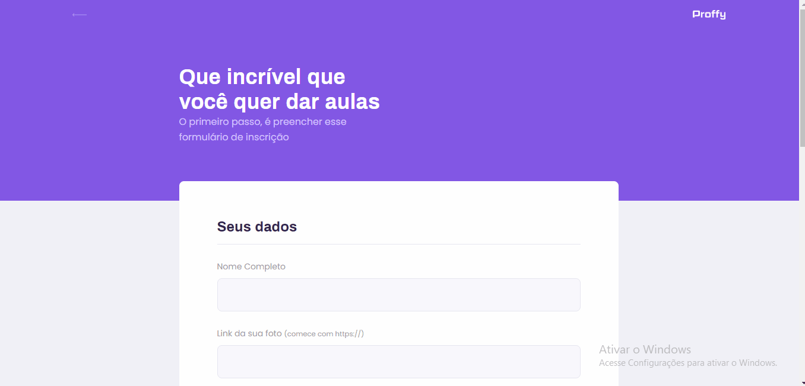

<html>
    

        
    

     
    <h3>
    Proffy é uma plataforma de estudo online onde você pode encontrar o seu professor preferido para estudar determinada matéria.
    </h3>
    

        
        
    

     
    <h3>
    No formulário de cadastro tem várias opções de horários, dias, matérias e etc. Para o professor que vai se cadastrar
    </h3>
    

        
        
    

     
    <ul>
        <li>
✔️ HTML5
</li>
        <li>
✔️ CSS3
</li>
        <li>
✔️ Javascript
</li>
        <li>
✔️ Responsividade
</li>
        <li>
✔️ Express
</li>
        <li>
✔️ SQLite
</li>
        <li>
✔️ API Whatsapp
</li>
    </ul>
     
    
📧 Email: louix.sm@gmail.com

     
    
📱 Instagram:

    <a href="https://www.instagram.com/louis.henrik" about="blank">
    https://www.instagram.com/louis.henrik/
    </a>
    
💼 Linkedin:

    <a href="https://www.linkedin.com/in/luis-henrique-3060961b4/">
    https://www.linkedin.com/in/luis-henrique-3060961b4/
    </a>
</html>
